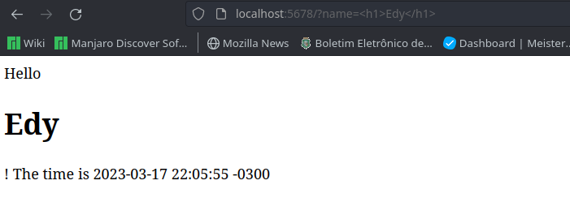
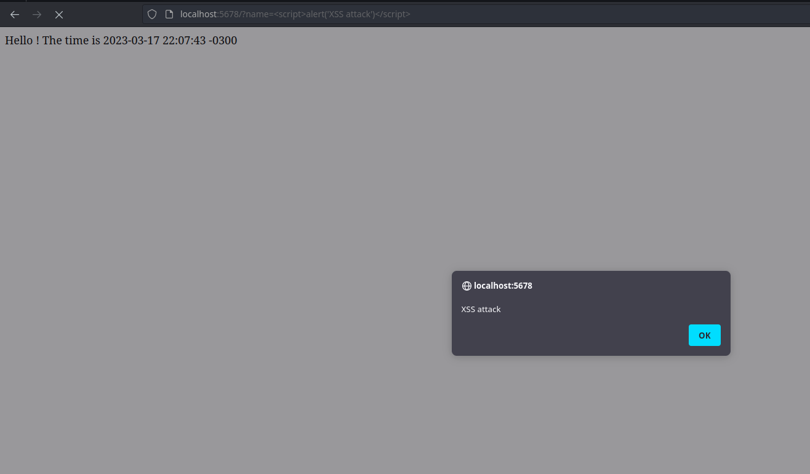
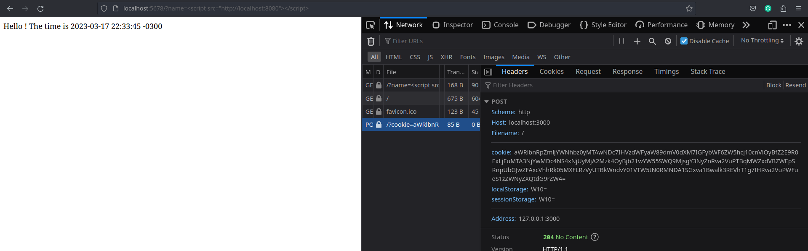
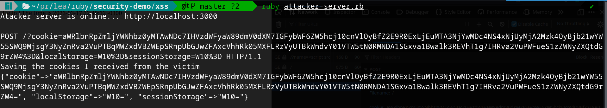
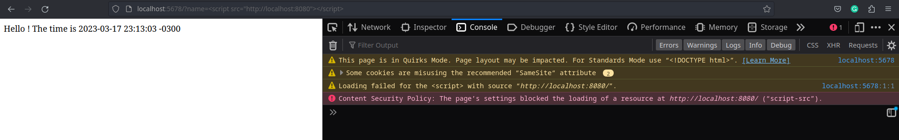
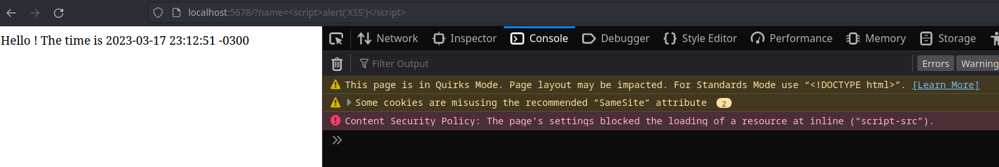
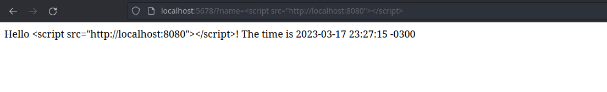

# Web Security Experiments

This repository contains some experiments on XSS, CSRF, and other known vulnerabilities that can be found in web applications.

This project aims to bring some demos and explain some defenses against those vulnerabilities like SOP (Same Origin Policy) and CSP (Content Security Policy).

## XSS Demo

Basically we have an application running on http://localhost:5678. This application is, on purpose, vulnerable to XSS attacks. This is basically a grettins app where we pass a name in the query string and it says `"Hello, {name}"` (eg. http://localhost:5678?name=Edy Silva).

The point is, we can pass anything in such a param :scream. We can do something like
`http://localhost:5678?name=<script>alert('XSS attack!')</script>`. That's really bad.

### Experiments

The basic one was to pass a simple `alert()`. After that I tried to do something more exciting like stealing some
cookies. So I created another ruby server that produces a JS file, then I injected inside of the _greetings app_. This
JS reads the cookies and sends, via XMLHttpRequest, to another server.

The request raises an error in the browser console. The error is due to Same Origin Policy. The interesting thing about
it is that the server still receives and processess the request. The browser only disallow the rendering from
a different origin. So, I could still steal cookies.

#### Basic demo



#### Stealing cookies
For that I used the `cookie-stealer.js` but inside of another server written in `fake-js-file.rb`. This code serves the
JS file which contains the malicious code.

The JS file sends the information to the attacker server as shown in the image below.




WARNING: even with cors error the request is sent.

### Defenses

- CSP Header
    By adding the `content-security-policy` we can mitigate this risk. Simply defining a policy as `script-src 'self'`
    it blocks any script from outside world and the inline ones.

    
    

    Reference: https://developer.mozilla.org/en-US/docs/Web/HTTP/Headers/Content-Security-Policy

    How to enable CSP in Rails -> https://www.stackhawk.com/blog/rails-content-security-policy-guide-what-it-is-and-how-to-enable-it/

- Input sanitization
    The bacic one. Just make sure you don't trust in the world. So, make some strip tags in the input you receive in
    your app. In ruby you can use erb for that.

    ```rb
    puts ERB::Util.html_escape '<script>alert("xss attack")</script>'
    # prints -> &lt;script&gt;alert(&quot;xss attack&quot;)&lt;/script&gt;
    ```

    that's a simple escape but it can keep us safe.

    
